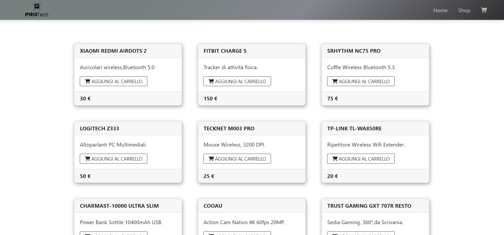

# AppFullStack - FrontEnd

This project is basically a kind of prototype of a simple ecommerce with also backoffice.

## Getting Started

To proceed with the local installation, you need to pull the project. After obtaining a copy of the project, it is necessary to initialize the MYSQL database via the "full_app.sql" file and, in addition, create an .env file with the database credentials.
Open the project file and in the terminal run `npm install` then run `ng serve` command in the terminal. Then open your favorite browser and go to this link (http://localhost:4200/) (verify output of terminal and take exactly port number) .

This project was generated with [Angular CLI](https://github.com/angular/angular-cli) version 14.0.2.

## Tools Used

Node npm

Angular

Laravel

Bootstrap

## Development server

Run `ng serve` for a dev server. Navigate to `http://localhost:4200/`. The application will automatically reload if you change any of the source files.

## Code scaffolding

Run `ng generate component component-name` to generate a new component. You can also use `ng generate directive|pipe|service|class|guard|interface|enum|module`.

## Build

Run `ng build` to build the project. The build artifacts will be stored in the `dist/` directory.

## Running unit tests

Run `ng test` to execute the unit tests via [Karma](https://karma-runner.github.io).

## Running end-to-end tests

Run `ng e2e` to execute the end-to-end tests via a platform of your choice. To use this command, you need to first add a package that implements end-to-end testing capabilities.

## Further help

To get more help on the Angular CLI use `ng help` or go check out the [Angular CLI Overview and Command Reference](https://angular.io/cli) page.
